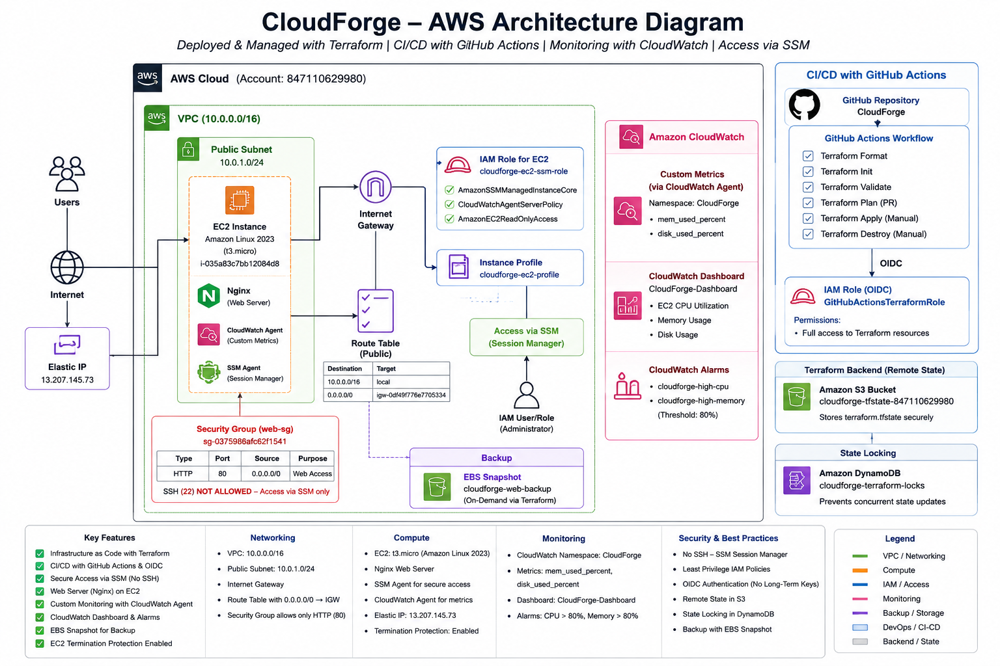

# CloudForge

**Terraform-managed AWS infrastructure with GitHub Actions CI/CD, SSM-based administration, CloudWatch observability, and backup safeguards.**

[Architecture Diagram](./docs/architecture/architecture-diag.png) | [Terraform Code](./terraform) | [User Data Script](./scripts/userdata.sh)

---

## Overview

CloudForge is a production-style AWS infrastructure project built with Terraform and automated through GitHub Actions. It provisions a secure, observable, and maintainable environment consisting of:

* a custom VPC with public and private subnets
* an Internet Gateway and public routing
* an EC2 web server running Nginx
* an Elastic IP for a stable endpoint
* SSM Session Manager for administrative access
* CloudWatch custom metrics, dashboard, and alarms
* EBS snapshot backup support
* Terraform remote state in S3 with locking in DynamoDB
* GitHub Actions CI/CD using GitHub OIDC (no long-lived AWS keys)

The project is designed to demonstrate practical Infrastructure as Code, cloud security, monitoring, and automation skills suitable for cloud engineering and DevOps roles.

---

## Architecture



### Logical flow

```text
GitHub Repository
  ↓
GitHub Actions (PR Validation / Apply / Destroy)
  ↓
GitHub OIDC → AWS IAM Role
  ↓
Terraform
  ↓
AWS
  ├── S3 Remote State
  ├── DynamoDB Lock Table
  ├── VPC
  │   ├── Public Subnet
  │   │   └── EC2 Web Server (Nginx)
  │   └── Private Subnet
  ├── Internet Gateway + Route Table
  ├── Security Group
  ├── Elastic IP
  ├── SSM Session Manager
  └── CloudWatch (Agent, Dashboard, Alarms)
```

### AWS resources

* **Networking**: VPC, public subnet, private subnet, Internet Gateway, route table, route table association
* **Compute**: EC2 `t3.micro` instance running Amazon Linux 2023 and Nginx
* **Security**: Security group with HTTP only; SSH removed; SSM used for admin access
* **Identity**: EC2 IAM instance profile with SSM and CloudWatch permissions; GitHub OIDC role for CI/CD
* **Observability**: CloudWatch agent, custom memory/disk metrics, dashboard, CPU and memory alarms
* **Reliability**: EBS snapshot backup and EC2 termination protection

---

## Results

Built and deployed a fully managed AWS environment with Terraform and GitHub Actions. Eliminate manual provisioning, remove long-lived secrets, improve observability, and make administration secure. Delivered a reproducible cloud environment with remote state, SSM access, Elastic IP, CloudWatch monitoring, alarms, and backup support.

A cloud environment needed to be provisioned, secured, monitored, and repeatably deployed without manual console work. Design a Terraform-based AWS platform with CI/CD, safe access controls, and production-style operational visibility. Implemented remote Terraform state, modular AWS networking, an EC2 web server, SSM-based access, CloudWatch monitoring, GitHub Actions workflows, and backup safeguards. Produced a stable infrastructure that deploys automatically through GitHub, exposes a working web endpoint, provides SSM administration, and includes monitoring and recovery controls.

---

## Key Features

* Terraform remote state stored in **S3**
* State locking using **DynamoDB**
* GitHub Actions workflows for **PR validation**, **apply**, and **destroy**
* GitHub **OIDC** authentication for AWS access
* Secure web server deployment on **EC2**
* **Elastic IP** for a stable public endpoint
* **SSM Session Manager** instead of SSH for administration
* **CloudWatch Agent** with memory and disk custom metrics
* **CloudWatch Dashboard** for operational visibility
* **CloudWatch Alarms** for CPU and memory thresholds
* **EBS snapshot** backup for the root volume
* **EC2 termination protection** to reduce accidental deletion risk

---

## Repository Structure

```text
CloudForge/
├── .github/
│   └── workflows/
│       ├── terraform-pr.yml
│       ├── terraform-apply.yml
│       └── terraform-destroy.yml
├── bootstrap/
│   └── main.tf
├── scripts/
│   └── userdata.sh
└── terraform/
    ├── backend.tf
    ├── backup.tf
    ├── compute.tf
    ├── eip.tf
    ├── iam.tf
    ├── locals.tf
    ├── monitoring.tf
    ├── networking.tf
    ├── outputs.tf
    ├── provider.tf
    ├── security.tf
    ├── terraform.tfvars
    ├── variables.tf
    └── versions.tf
```

---

## Terraform Design

### Backend

The project uses a remote backend to store Terraform state and prevent concurrent writes.

```hcl
terraform {
  backend "s3" {
    bucket         = "cloudforge-tfstate-847110629980"
    key            = "dev/terraform.tfstate"
    region         = "ap-south-1"
    dynamodb_table = "cloudforge-terraform-locks"
    encrypt        = true
  }
}
```

### Provider and default tags

```hcl
provider "aws" {
  region = var.aws_region

  default_tags {
    tags = local.common_tags
  }
}
```

### Common variables

* `aws_region`
* `environment`
* `vpc_cidr`
* `public_subnet_cidr`
* `private_subnet_cidr`
* `instance_type`

### Local values

```hcl
locals {
  project_name = "cloudforge"

  common_tags = {
    Project     = "CloudForge"
    ManagedBy   = "Terraform"
    Environment = var.environment
    Owner       = "anup"
  }
}
```

---

## CI/CD Workflow

### Pull Request validation

Runs on every PR to `main`:

* `terraform fmt -check -recursive`
* `terraform init`
* `terraform validate`
* `terraform plan -no-color`

### Apply on merge

Runs on push to `main`:

* `terraform init`
* `terraform validate`
* `terraform apply -auto-approve`

### Destroy on demand

Runs manually with workflow dispatch:

* `terraform init`
* `terraform destroy -auto-approve`

---

## Security Model

* No AWS access keys stored in GitHub Secrets
* GitHub Actions authenticates to AWS using OIDC
* SSH access removed from the security group
* SSM Session Manager is used for administration
* EC2 termination protection enabled
* Terraform state encryption enabled in S3
* State locking enabled with DynamoDB

---

## Monitoring and Observability

CloudForge publishes custom metrics to CloudWatch:

* `mem_used_percent`
* `disk_used_percent`

The monitoring layer includes:

* CloudWatch Dashboard: `CloudForge-Dashboard`
* CPU alarm: `cloudforge-high-cpu`
* Memory alarm: `cloudforge-high-memory`

---

## Backup Strategy

The root volume is protected with a Terraform-managed EBS snapshot:

* `cloudforge-web-backup`

This demonstrates disaster recovery awareness and backup discipline.

---

## Deployment

### Prerequisites

* AWS CLI configured locally
* Terraform installed
* GitHub repository connected to AWS OIDC role

### Local commands

```bash
cd terraform
terraform init
terraform fmt -recursive
terraform validate
terraform plan
terraform apply
```

### Destroy

```bash
terraform destroy
```

Or use the GitHub Actions destroy workflow.

---

## Important Files

### Terraform entry points

* [Backend configuration](./terraform/backend.tf)
* [Provider configuration](./terraform/provider.tf)
* [Variables](./terraform/variables.tf)
* [Compute resources](./terraform/compute.tf)
* [Networking](./terraform/networking.tf)
* [Security group](./terraform/security.tf)
* [Monitoring](./terraform/monitoring.tf)
* [Backup](./terraform/backup.tf)
* [Outputs](./terraform/outputs.tf)

### Automation

* [PR validation workflow](./.github/workflows/terraform-pr.yml)
* [Apply workflow](./.github/workflows/terraform-apply.yml)
* [Destroy workflow](./.github/workflows/terraform-destroy.yml)

### Bootstrap

* [S3 + DynamoDB bootstrap](./bootstrap/main.tf)

### Runtime bootstrap script

* [EC2 user data script](./scripts/userdata.sh)

---

## Screenshots

| Screenshot               | Suggested filename                  |
| ------------------------ | ----------------------------------- |
| Project structure        | `02-project-structure.png`          |
| Terraform apply success  | `03-terraform-apply-success.png`    |
| Terraform no changes     | `04-terraform-no-changes.png`       |
| Website running          | `05-cloudforge-website.png`         |
| EC2 instance running     | `06-ec2-instance-running.png`       |
| VPC networking           | `07-vpc-networking.png`             |
| Security group rules     | `08-security-group-rules.png`       |
| Elastic IP               | `09-elastic-ip.png`                 |
| SSM session              | `10-ssm-session-manager.png`        |
| CloudWatch metrics       | `11-cloudwatch-custom-metrics.png`  |
| CloudWatch dashboard     | `12-cloudwatch-dashboard.png`       |
| CloudWatch alarms        | `13-cloudwatch-alarms.png`          |
| GitHub Actions success   | `14-github-actions-success.png`     |
| S3 backend               | `16-s3-terraform-backend.png`       |
| DynamoDB lock table      | `17-dynamodb-lock-table.png`        |
| EBS snapshot             | `19-ebs-snapshot-backup.png`        |
| CloudWatch agent running | `20-cloudwatch-agent-running.png`   |

---

## Example Outputs

### Terraform output

```hcl
output "web_server_public_ip" {
  value = aws_eip.web.public_ip
}

output "web_server_public_dns" {
  value = aws_instance.web.public_dns
}
```

### User data

```bash
#!/bin/bash

dnf update -y

dnf install nginx -y

systemctl enable nginx
systemctl start nginx

echo "<h1>CloudForge Deployed via Terraform</h1>" > /usr/share/nginx/html/index.html
```

---

## Future Improvements

* Split the project into reusable Terraform modules
* Add an Application Load Balancer and Auto Scaling Group
* Move the application server into a private subnet
* Add CloudWatch log ingestion from Nginx
* Add Systems Manager automation for patching
* Add backup lifecycle policies for snapshots

---

## Contact
Anup Das

Email: anupddas8@gmail.com
